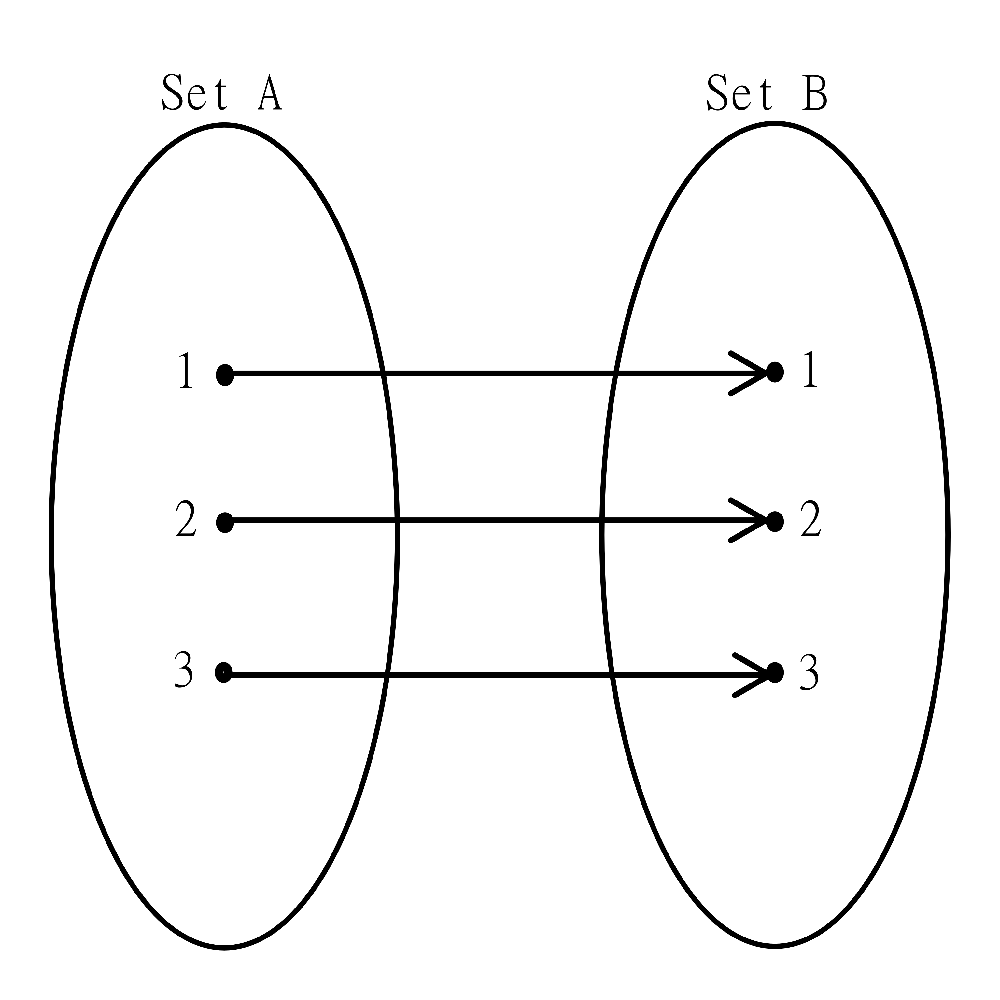

# Review: Relations

Mathematical Relations denote what relationships exist between objects of two sets. Next week, we will discuss the relationship between relations and functions.

## Readings

> Please read this first before moving on to the documents here on Anchor.
> As a reminder, and for reference, specific chapters are referenced at the beginning of the section for which they are relevant.
> Feel free to go back to the text(s), or review it if there's been a break since you last read the material.
> The readings on Anchor have some information in common with the text(s). This is to ensure you see the information from some different perspectives.

[Applied Discrete Structures](https://discretemath.org/ads/chapter_6.html), [Chapter 6.1-6.3](https://discretemath.org/ads/s-basic-definitions.html)

## Mathematical Definition

[Chapter 6.1](https://discretemath.org/ads/s-basic-definitions.html)

> Remember: Please read the text linked above before reading the material below.

A relation is any subset of the cross product of two sets. The relation will contain all ordered pairs that are related. Note that relations are sometimes directional. An element a may be related to b, but this doesn't mean b is related to a. We sometimes denote a relation as $aRb$, meaning $a$ relates to $b$.

A simple example. Let set A = \{ m, a, t, h \}, and set B = \{1, 2, 3 \}

A simple relation could be $\{(m, 1), (m, 3), (t, 1)\}$

We could also define a relation by a rule. We could have a relation that states that consonents are related to even numbers, and vowels are related to odd numbers. In our sets, this would result in the relation

$$\{ (m, 2), (a, 1), (a, 3), (t, 2), (h, 2) \}$$

We can also define relations on a set to itself. It's quite common to define a relation on sets like the integers or real numbers. For example, we can define a relation that states that every integer is related to the next consecutive integer.

$$\{... (-3, -2), (-2, -1), (-1, 0), (0, 1), (1, 2), (2, 3), ...  \}$$

> Check your understanding: Create your own example of a relation. What two sets are you pulling the relations from? Does your relation have infinitely many elements or only a finite number of elements?

Check your answer

The answer here depends on the relation you made. If you created a relation on finite sets, you should only be able to make a finite number of relations. If you have an infinite set, you could make infinitely many relations or finitely many relations.

## Visual Representations

[Chapter 6.1](https://discretemath.org/ads/s-basic-definitions.html) and [6.2](https://discretemath.org/ads/s-graphs-of-relations-on-a-set.html)

> Remember: Please read the text linked above before reading the material below.

We can represent relations using a diagram. This only works well for small examples, but can help visualize the relation and relation properties.

## Properties of Relations

[Chapter 6.3](https://discretemath.org/ads/s-properties-of-relations.html)

> Remember: Please read the text linked above before reading the material below.

There are a few important properties of relations. These properties help us to classify relations, and will help in our definition of equivalence relation later.

Note that these properties are defined for a relation on a single set. We will not discuss what happens for a relation on two different sets.

**Symmetric**

A symmetric relation requires that if a is related to b, then b is related to a. Basically, this ensures no directional relations.

**Reflexive**

A reflexive relation requires that every element in the set is related to itself.

**Transitive**

A transitive relation states that if a is related to b, and b is related to c, then a is related to c. It is similar to the idea of transitivity present in other parts of mathematics.

The first image example of a relation is transitive. The symmetric example is not.

> Check your understanding: Is the reflexive relation pictured above transitive?

Check your answer

Yes! Since this is a simple relation, it also happens to be transitive.

**Antisymmetric**

A relation is antisymmetric if a relating to b and b relating to a implies that a=b. In other words, there are _only_ directional relations (including those that point to themselves).

**Irreflexive**

A relation is irreflexive if no element is related to itself.

It may seem on first glance that symmetric is the opposite of antisymmetric and reflexive is the opposite of irreflexive. However, there are relations which are both symmetric and antisymmetric ($R_1$). There are also relations which are neither symmetric nor antisymmetric ($R_2$). There are relations that are neither reflexive nor irreflexive as well($R_3$).

> Think first: Can you come up with a simple relation that is both symmetric and antisymmetric? What about one that is neither reflexive nor irreflexive?

Let $A = \{1, 2, 3\}$

$$R_1 = \{(1,1), (2,2), (3,3) \}$$

$$R_2 = \{ (1,2), (2, 1), (3, 1) \}$$

$$R_3 = \{ (1,1), (2,2)\}$$

You cannot assume that if a set is symmetric, then it is not antisymmetric, or vice versa. The same applies to reflexive and irreflexive. Make sure to refer back to the definitions when identifying which properties apply to relations.

Let's look at some familiar relations and practice.

Consider $aRb$ if $a < b$ (a is less than b).

This is not symmetric. $1 < 2$, but $2 \not< 1$.

This is not reflexive. $1 \not< 1$.

This is transitive. If $a < b$ and $b < c$, then $a < c$.

This is antisymmetric. There is no case where $a < b$ and $b < a$, the first part of the implication is never satisfied.

This is irreflexive. $a < b$ implies that $a \not= b$.

Now consider $a \leq b$ instead.

> Think first: What changes?

It becomes reflexive, and irreflexive is no longer true. Antisymmetric is still true since when $a \leq b$ and $b \leq a$, this requires that $a = b$.

Consider the relation $aRb$ when $a = b$

> Check your understanding: What properties hold for this relation? Which properties fail? Where is it different from $a \leq b$?

Check your answer

This is reflexive, symmetric, and transitive. It is also antisymmetric, just like $a \leq b$. This relation is also clearly not irreflexive. So it has the same properties as $a \leq b$, except that it is now also symmetric!

