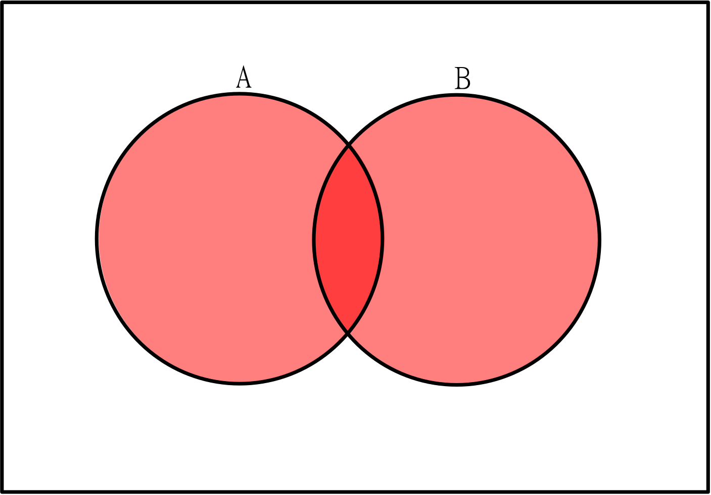

## Subsets

[Chapter 1.1](https://discretemath.org/ads/s-set-Notation-and-Relations.html)

> Remember: Please read the text linked above before reading the material below.

Consider two sets A and B. Set A is a subset of set B if for every element in A, the same element is in B. Mathematically,

$$A \subseteq B = \forall x \in A, x \in B$$

Note this allows A to be a subset of itself! This is called an **improper subset**, and gives an intuition as to proving set equality.

If we want to prove two sets, A and B, are equal, we can prove that A is a subset of B and that B is a subset of A. This is similar in idea to proving two numbers are equal by showing $a \leq b$ and $b \leq a$. We'll visit this idea more after defining some operations.

Any subset that isn't improper is called a **proper subset**.

> Think first: Given this definition of subset, is the empty set a subset of any sets?

We actually can show the empty set is a subset of all sets. Since it contains no elements, all of its elements are in any set in existance, including the empty set itself.

Given that we have a set that is the subset of all sets, we also define the **Universe** as the set that is the superset of all sets. In other worse, all sets defined are subsets of the Universe.

The Universe is usually defined by context. It might be all numbers, all letters, all integers, or some other set depending on the problem being discussed. The Universe should be defined in most operations on sets, so these operations themselves can be defined.

## Intersection, Union, Difference, and Complement

[Chapter 1.2](https://discretemath.org/ads/s-basic_Set_Operations.html)

> Remember: Please read the text linked above before reading the material below.

The operation where a Universe is most important is the **Complement**. The complement of a set is all elements of the universe that are not in the set.

The **intersection** of two sets is the set of all elements they have in common. If two sets have no elements in common, the intersection will be the empty set. Sets which have no elements in common are called **disjoint**.

The **union** of two sets is the set of all elements they contain. This combines all elements into one set, making sure there are no duplicates since sets must contain unique elements.

The **difference** of two sets is all elements of the first set that are not in the second set. This can be denoted two ways.

$$B - A$$

$$B / A$$

>Check your understanding: Which of these operations are commutative?

Check your answer

Union and difference are commutative. Complement is only completed on one set, and for difference, the order of the sets matters.

We can combine these operations to create similar identities to the logical laws.

| Identity | Name |
| --- | --- |
|$A \cup B = B \cup A$| Commutative Law (union) |
|$A \cap B = B \cap A$| Commutative Law (intersection) |
|$(A \cup B) \cup C = A \cup (B \cup C)$| Associative Law (union) |
|$(A \cap B) \cap C = A \cap (B \cap C)$| Associative Law (intersection) |
|$A \cap (B \cup C) = (A \cap B) \cup (A \cap C)$| Distributive Law |
|$A \cup (B \cap C) = (A \cup B) \cap (A \cup C)$| Distributive Law |
|$A \cup \emptyset$ = A | Identity Law |
|$A \cap U = A$| Identity Law |
|$(A^c)^c = A$| Double Complement |
|$A \cup A = A$| Idempotent Law |
|$A \cap A = A$| Idempotent Law |
|$(A \cup B)^c = A^c \cap B^c$| DeMorgan's Law |
|$(A \cap B)^c = A^c \cup B^c$| DeMorgan's Law |
|$A - B = A \cap B^c$| Set Difference Law|

> Check your understanding: Try drawing a picture of one of the identities. First draw the left side, then draw the right side. Do your pictures match?

Check your answer

Your answer here depends on your decision, but if your two drawings don't match, try starting again.

To prove these identities, and other relations between sets, we can use subset proofs. We start with an arbitrary element in one side of the identity, and show it exists in the other. This proves a subset relation between the two sets. If we can also show the opposite direction, we have proved equality, as mentioned earlier.

For example, if we wish to prove $A - B = A \cap B^c$

We start by assuming an arbitrary $x \in A - B$

By definition of difference, this means $x \in A$ and $x \not\in B$

$x \not\in B$ means $x \in B^c$ by definition of complement.

$x \in A$ and $x \in B^c$ means $x \in A \cap B^c$ by definition of intersection.

Since $x \in A - B$ implies $x \ in A \cap B^c$,

$A - B \subseteq A \cap B^c$

Now we need to complete the other direction.

Assume we have an arbitrary $x \in A \cap B^c$

By definition of intersection, $x \in A$ and $x \in B^c$.

Since $x \in B^c$, $x \not\in B$ by definition of complement.

$x \in A$ and $x \not\in B$ means that $x \in A - B$ by definition of set difference.

Since $x \in A \cap B^c$ implies $x \in A - B$,

$A \cap B^c \subseteq A - B$

Now we have $A - B \subseteq A \cap B^c$ and $A \cap B^c \subseteq A - B$, which means

$A \cap B^c = A - B$

> Think about it: Try completing a subset proof on one of the other identities listed above. The identities involving complement can be tricky, so if you want a challenge, try one of those!
