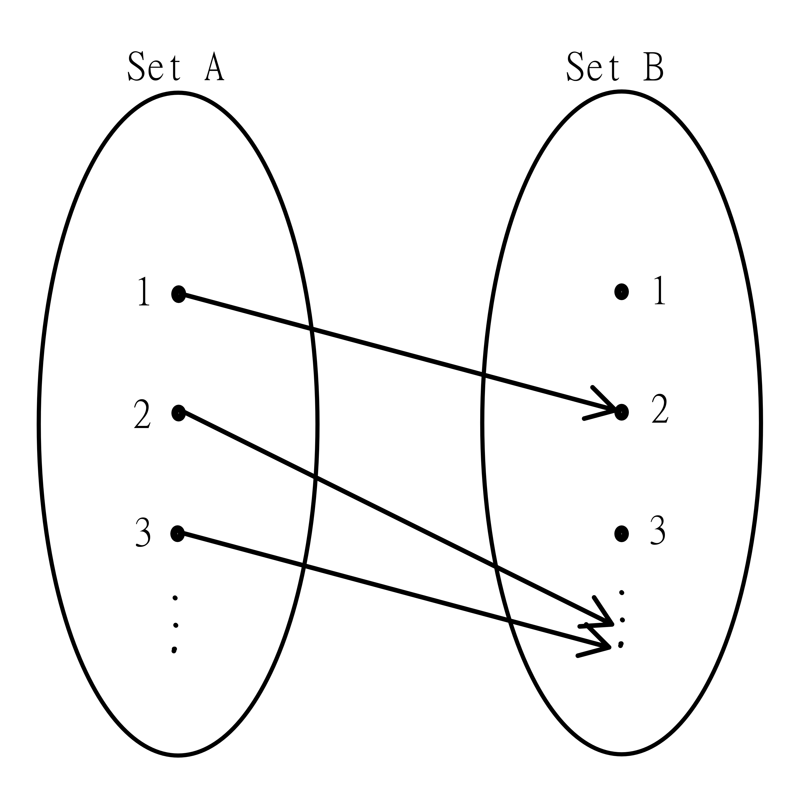
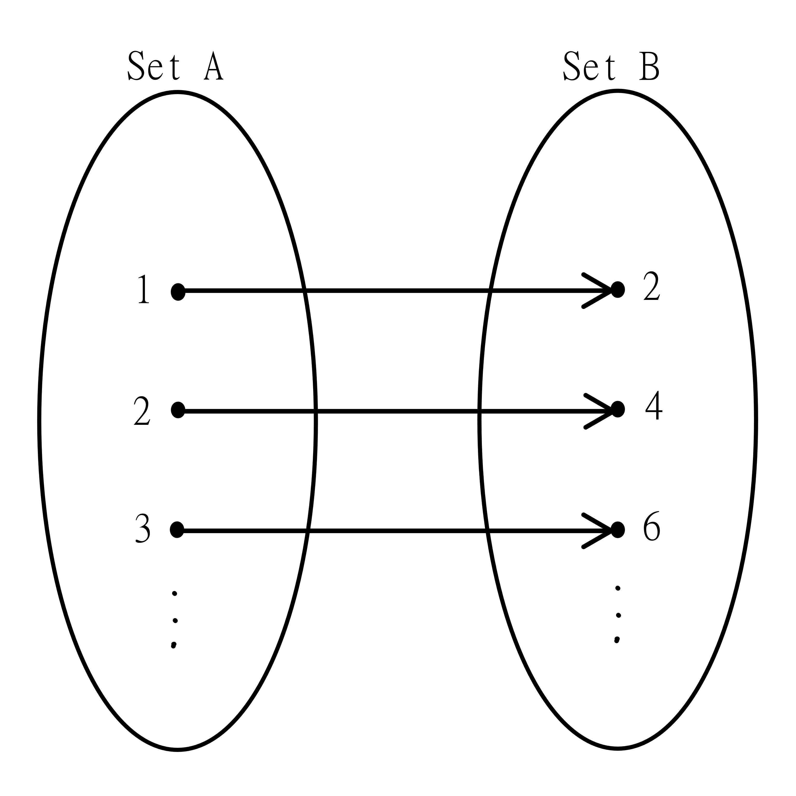
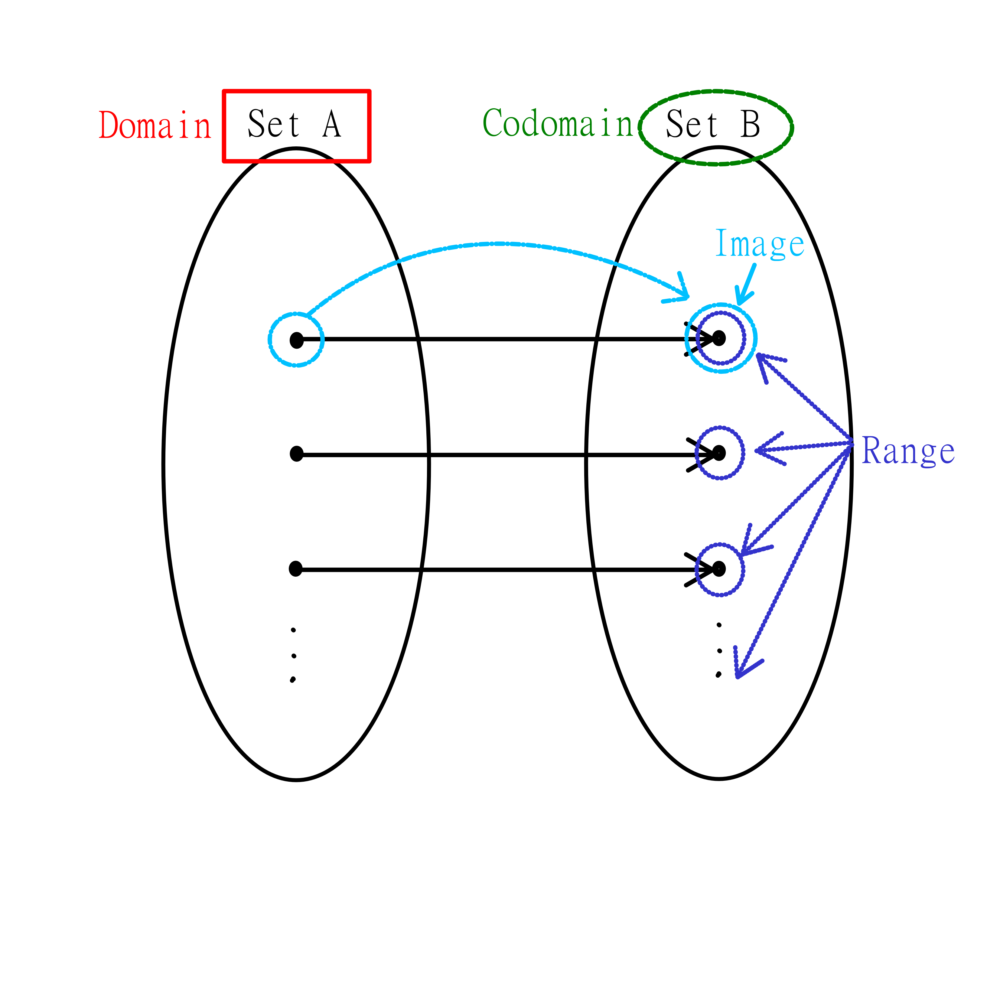

# Functions

Functions have slightly different definitions in programming versus mathematics. Mathematical functions allow us to define specific relations and discuss what properties these relations might have.

## Readings

> Please read this first before moving on to the documents here on Anchor.
> As a reminder, and for reference, specific chapters are referenced at the beginning of the section for which they are relevant.
> Feel free to go back to the text(s), or review it if there's been a break since you last read the material.
> The readings on Anchor have some information in common with the text(s). This is to ensure you see the information from some different perspectives.

[Applied Discrete Structures](https://discretemath.org/ads/chapter_7.html), [Chapter 7.1-7.3](https://discretemath.org/ads/s-function-def-notation.html)

## Function Definitions
[Chapter 7.1](https://discretemath.org/ads/s-function-def-notation.html)

> Remember: Please read the text linked above before reading the material below.

The basic idea of a function is that every possible input is turned into exactly one output. This is the basic structure any function must follow.

> Think about it: Which of the following are functions?
> - Inputting a student name, and the output gives the student's ID.
> - Inputting a grade, and the output is a student who earned that grade.
> - Inputting an email address, and the output is the student associated with the email.
> - Inputting a course name, and the output is a student in the course.

We typically denote functions with an $f$ symbol (or occasionally other letters), with the input in parentheses directly after. For example, $f(2)$ would indicate what the function output is, for an input of 2. 

If we already know the answer, we can say what it is! If our function is simply to multiply the input by 2, then we know $f(2) = 4$.

We can also use this to define our function. So for any input $x$, we know the output will be simply $2x$, so we can write

$$f(x) = 2x$$

> Check your understanding: This function will end up outputting only even numbers when integers are the input values. Can you change the function to make it output only odd numbers with integer-valued inputs?

Check your answer

$f(x) = 2x + 1$ or $f(x) = 2x - 1$ are the simplest answers, though there could be others!

### Functions and Relations

A function can also be defined as a relation, where each element of the first set is related to exactly one element of the second set. For example, from our student function above, we have the relation from the set of students to the set of email addresses, where a student is related to their email address. We can complete pictures as we did with previous relations.

#### Domain and Co-domain

When defining functions under relations, we say that every element of the first set is related to some element in the second. We call the first set the **domain** and the second set the **codomain**. Note that we only specify that every element of the domain must be useable by the function, the codomain can have elements that are not outputs of the function.

Remember the function $f(x) = 2x$.

Since we're dealing with numbers, we could define the domain as the Integers or the Real Numbers. If we do this, we'll likely define the codomain as the same, even though we know the output will be only even numbers. When we define a numerical function, we usually use our set notation to describe what domain and codomain we will be using. Since a function is a relation from the domain to the codomain, this is usually denoted with an arrow between.

$f: \mathbb{R} \rightarrow \mathbb{R}, f(x) = 2x$

$f: \mathbb{Z} \rightarrow \mathbb{Z}, f(x) = 2x$

> Check your understanding: Which of these functions is only defined on even integers?

Check your answer

The second is defined only on the integers, and is therefore only defined on even integers. It's the only one to guarantee even numbers as output as well.

Notice for the other function, I could let $x = \frac{1}{2}$, and it would output 3, which is certainly not even.

The image above and below both depict this type of function, however, the one below might be misleading, as it does not include all values in the codomain. It is not immediately clear that the one above is for the function $f(x) = 2x$, since it cuts off before $4$ and $6$, so neither diagram is perfect, which is why we use notation rather than images.

#### Image and Range

As noted prior, $f(x)$ for any given function represents the value it takes in the codomain. $f(x)$ is known as the **image** of x under $f$.

The collection of images for all possible $x$ in the domain is known as the **range** of a function.

>Think first: The range will be a subset of the codomain, since it's the set of images under the function. Is there a simpler way you could describe the range of a function?

We can also think of the range as all possible outputs of the function.

## Multiple-Variable Functions
[Chapter 7.1](https://discretemath.org/ads/s-function-def-notation.html)

> Remember: Please read the text linked above before reading the material below.

We can also define functions that take in multiple values. For example, consider the simple function:

$$f(x, y) = x + y$$

We still need to be careful that each input maps to only one output. However, each input is now not just a single value. The input $(1, 2)$ is different from $(2, 1)$, so if these were to result in different values, this would still be an acceptable function.

>Think about it: What multi-variable functions exist in real life?
