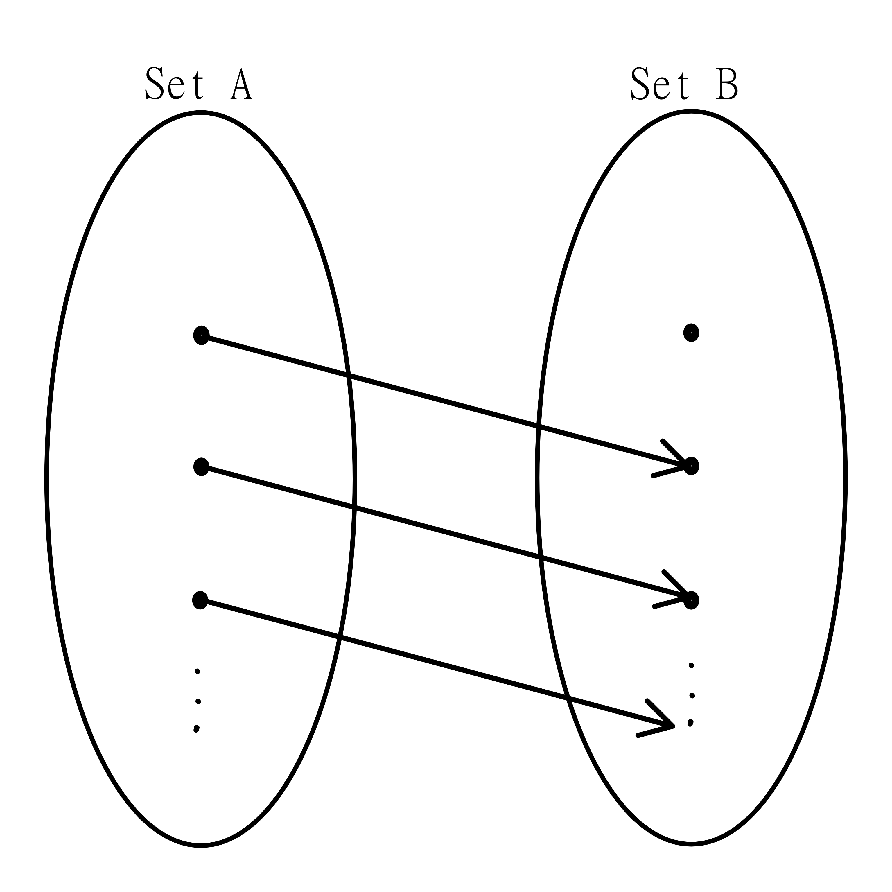
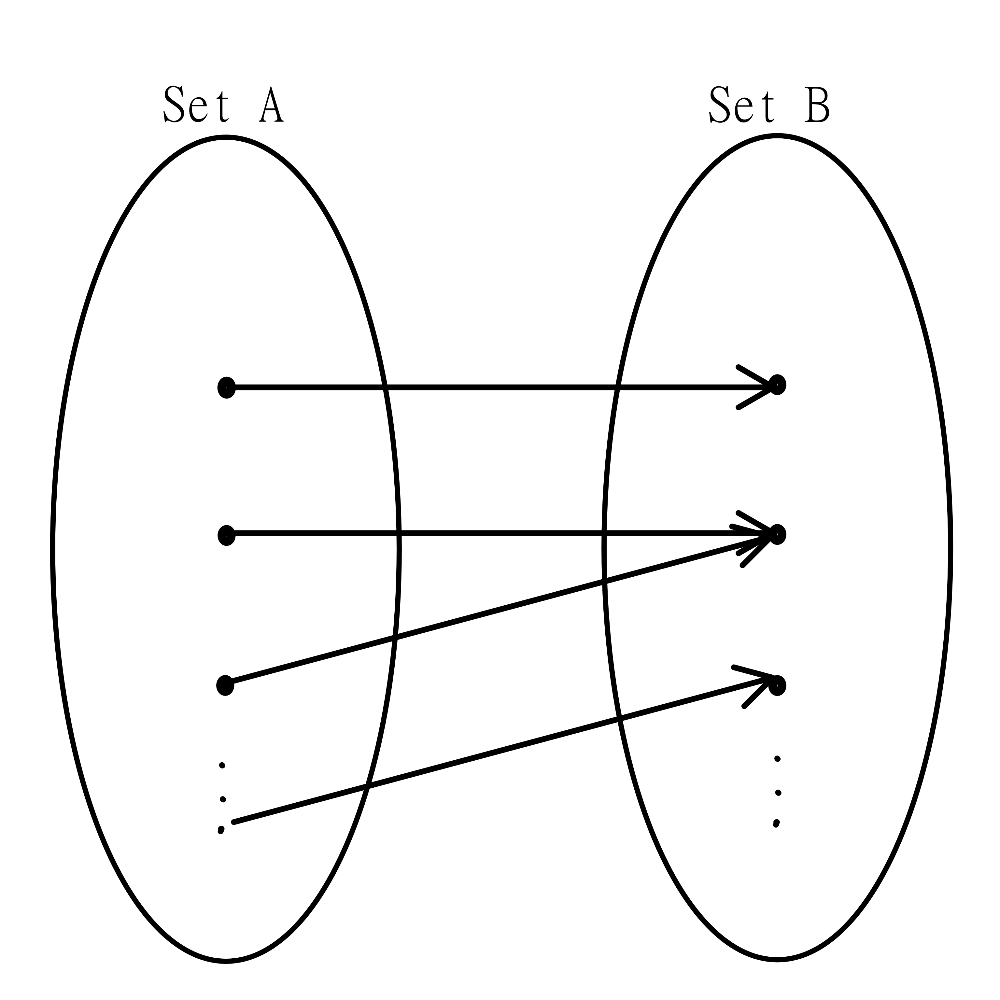

## Injective, Surjective, Bijective Functions
[Chapter 7.2](https://discretemath.org/ads/s-properties-of-functions.html)

> Remember: Please read the text linked above before reading the material below.

Functions can fall into a few important categories. 

**Injective functions** require that every input maps to a _unique_ output, that is, no two inputs result in the same output. Mathematically, we write that 

$$f(a) = f(b) \rightarrow a = b$$

To prove a function is injective, we must prove this statement is true. In general this involves simply starting with $f(x) = f(y)$, and doing operations on both sides until $x = y$.

Consider the function $f(x) = 3x + 1$

$f(a) = f(b)$

$3a + 1 = 3b + 1$

$3a = 3b$

$a = b$

This function is injective.

**Surjective functions** are functions whose outputs cover the entire codomain. Mathematically, we write that

$$\forall y \in B, \exists x \in A \text{ s.t. } y = f(x)$$

_Note: s.t. is a common mathematical abbreviation for such that_

Where $A$ is the domain and $B$ is the codomain. Surjective functions require that the range is equal to the codomain. Typically this is proven by starting with $y = f(x)$ and doing operations until there is a an ending statement of $x = g(y)$ where $g(y)$ is expression in terms of $y$ that would fall inside the domain of the function, no matter what value of $y$ is chosen.

Consider the function $f(x) = 3x + 1$, where the domain and codomain are the real numbers.

$y = 3x + 1$

$y - 1 = 3x$

$\frac{y - 1}{3} = x$

If $y$ is a real number, then $\frac{y - 1}{3}$ is a real number.

This function is surjective.

As a note, the images shown for injective and surjective were carefully drawn so that the injective function was not surjective (it misses the first point), and the surjective function was not injective (it doubles up on a point).

**Bijective functions** are functions that are both injective and surjective. These functions are very special, as they show a relationship between the domain and the codomain that we will explore in the next section.

>Check your understanding: Consider all functions of the form $y = ax + b$, where $a$ and $b$ are integers, and the function's domain and codomain are the real numbers. Show this type of function is always bijective.

Check your answer

We'll use c and d to avoid confusion between variables.

$f(c) = f(d)$

$ac + b = ad + b$

Subtract $b$

$ac = ad$

Divide by $a$

$c = d$

Therefore, this function is injective.

$y = ax + b$

$y - b = ax$

$\frac{y - b}{a} = x$

If $y$ is a real number, then $\frac{y - b}{a} = x$ is also a real number.

Therefore, the function is surjective.

Since it's injective and surjective, it's bijective.

