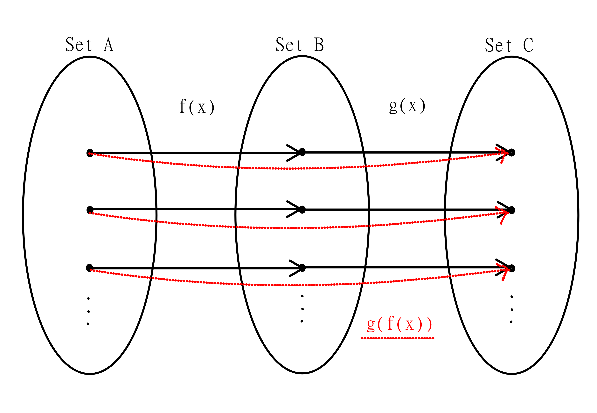
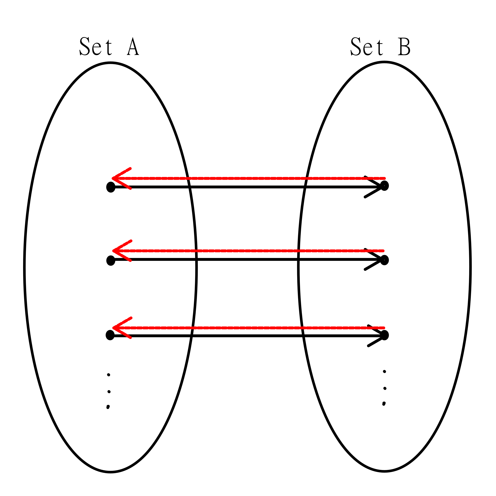

## Composition
[Chapter 7.3](https://discretemath.org/ads/s-function-composition.html)

> Remember: Please read the text linked above before reading the material below.

We can input values into functions, but we can also input functions into functions. This is known as function composition. We denote this as

$g(f(x)) = g \circ f(x)$

This will form a new function, with the domain being the domain of $f$, and the codomain being the codomain of $g$. Note that for this to work, the range of $f$ needs to fall within the domain of $g$.

For example,

$f(x) = x^2$

$g(x) = x + 1$

$f \circ g(x) = f(g(x)) = f(x+1) = (x+1)^2$

Note that this is not necessarily the same as the other way around:

$g(f(x)) = g(x^2) = x^2 + 1$

> Think about it: Are there any functions you can think of where $f(g(x)) = g(f(x))?$

## Inverse
[Chapter 7.3](https://discretemath.org/ads/s-function-composition.html)

> Remember: Please read the text linked above before reading the material below.

For functions which are injective, we can calculate the function's inverse function. This function, when composed with the original, gives the value $x$, in either order. The inverse function "undoes" a function. We denote this as follows:

$$f^{-1}(x)$$

The inverse function can also be thought of by turning the direction of the arrows in a set diagram.

We need the function to be injective, so the inverse function will have unique values for every input. We can calculate the inverse function by swapping the $x$ and $y$ values, then solving for $y$.

For example,

$f(x) = 3x + 1$

$y = 3x + 1$

$x = 3y + 1$

$x - 1 = 3y$

$\frac{x - 1}{3} = y$

$f^{-1}(x) = \frac{x - 1}{3}$

> Think about it: What do you think happens when we take the composition of a function with its inverse? That is, what is $f(f^{-1}(x))$? Does this change if the composition is swapped?
>
> This gives us a more mathematical definition of an inverse function, and is typically what you'll see in math texts.

> Think about it: The text states only bijective functions can have an inverse. Why do you think this is a requirement?

## Permutation
[Chapter 7.3](https://discretemath.org/ads/s-function-composition.html)

> Remember: Please read the text linked above before reading the material below.

A function can map a set to itself. When this function is also bijective, this is called a permutation, as the function "rearranges" the values of the set.

Typically, we think about permutations with finite sets, but we can apply it to infinite sets as well.

This operation is not as important or common as others, but is good to know.