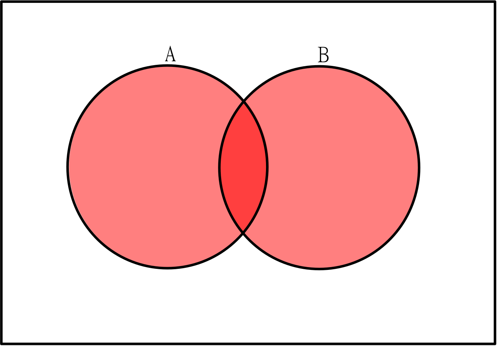

## Fixing the principles

#### Inclusion-Exclusion
[Chapter 1.6](https://discrete.openmathbooks.org/dmoi3/sec_advPIE.html)
[Chapter 2.3](https://discretemath.org/ads/s-partitions-and-law-of-addition.html)

> Remember: Please read the texts linked above before reading the material below.

The addition principle can be fixed for the red/5 card example by using a method called **Inclusion-Exclusion**. This is sometimes called the Principle of Inclusion-Exclusion and abbreviated as PIE.

This problem only had two sets, and the overlap is just the one card: the red 5.

So, we count normally at first, 5 red + 6 fives = 11 options. However, the red 5 card is counted twice, once in the reds, and once in the fives. Therefore, we simply subtract 1, as this is the overlap between the sets. 11 - 1 = 10. When we subtract one copy of the red 5, the other remains, and now we have a perfect set of cards which could be drawn to satisfy red or five.

In a Venn diagram, we can see that if we color both sets, the intersection is colored twice over.

If there are three sets, we can do something similar. Suppose we now have a copy of each card for each one of 4 letters: k, i, b, and o. So there will be a red card with a 1 and a k, a red card with a 1 and an i, a red card with a 2 and a k, and so on, meaning our deck now has 120 cards.

Now we change our question: In how many ways could a person draw a red card, a 5 card, or a card with a k.

The red 5 is still an issue (and now there are 4 copies: one for each letter), but so is the red-5-k card, all the red cards with a k, and any card that has a 5 and a k.

Note that when we start our simple approach: 20 red + 24 fives + 30 k-cards, that the red-5-k card is counted 3 times! All other categories mentioned are counted twice, so we can start with those.

There are now 4 red-5 cards, then we must count the red cards with a k (5: one for each number), and the number of cards with a 5 and a k (6: one for each color).

Now we can subtract one copy of each of these, and be left with a better answer.

$$20 + 24 + 30 - 4 - 5 - 6 = 59$$

However, there is one thing we're missing.

> Think first: Can you figure out the last step? What happened when we subtracted each of these overlaps between two groups?

The red-5-k card is in all of these groups, so we've subtracted it 3 times. But it was only in there 3 times to begin with, so we need to add it back in.

$$59 + 1 = 60$$

This pattern of subtracting overlaps, then adding overlaps continues for any set of groups, though it's hard to picture for larger numbers of sets.

> Think about it: Draw a Venn Diagram with three circles. Color in areas for each step, keeping track of how many times you color over a specific region. Does this align with Inclusion-Exclusion?

In general, you add the amount from each set, then subtract from all the intersections of two sets, then add all the intersections of 3 sets, then subtract all the intersections of 4 sets and so on until your last intersection includes all the sets.

This is the Inclusion-Exclusion method.