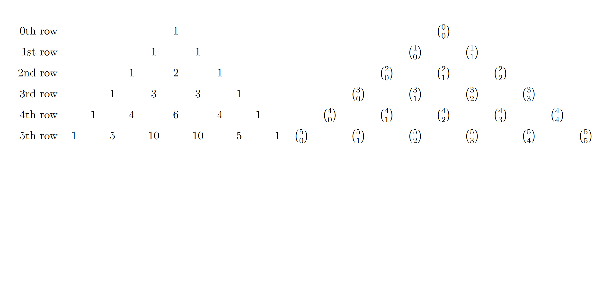

## Pascal's Triangle

Pascal's Triangle is a famous mathematical structure that contains combinations and important identities. Here are two versions of the first few rows.

We consider the top row to be the 0th row, then the 1st row underneath it, 2nd row underneath that and so on.

This triangle showcases some important properties of combinations, as well as displaying a topic we will discuss later.

> Think about it: Just looking at the structure now, what do you notice? Do you see any patterns?
> What would be the easiest way to start writing this triangle from scratch? Is computing all the combinations easiest, or is there a different way to look at the triangle?