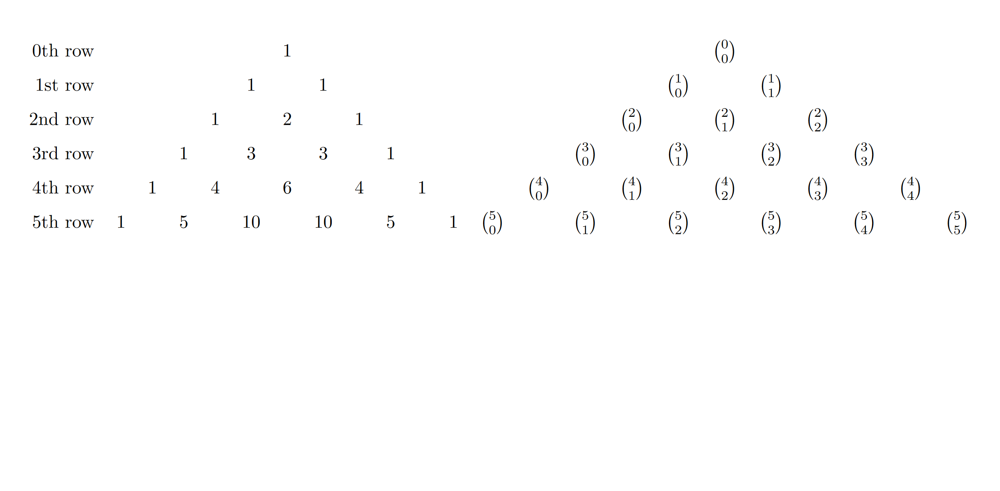

## Pascal Identities
[Chapter 1.2](https://discrete.openmathbooks.org/dmoi3/sec_counting-binom.html)
[Chapter 1.4](https://discrete.openmathbooks.org/dmoi3/sec_comb-proofs.html)

> Remember: Please read the texts linked above before reading the material below.

Pascal's triangle has many patterns and identities within the structure.

> Think first: Try finding as many identities as you can. What do you notice about Pascal's triangle?
> Are there any relationships between rows?
> Are there any relationships in each row?

Below is a table of a few identities and the way we see them in the triangle.

| Identity | Where it is in Pascal's Triangle |
| --- | --- |
| ${n \choose k} = {n-1 \choose k-1} + {n-1 \choose k}$ | Each entry is the sum of the two entries above it in the triangle. |
| $\sum_{k=0}^n {n \choose k} = 2^n$ | The $n$th row sums to $2^n$. |
| ${n \choose k} = {n \choose n-k}$ | The rows in Pascal's triangle are symmetric. |
| $\sum_{k=0}^n (-1)^k{n \choose k} = 0$ | When you alternate adding and subtracting each entry in a row, the value is 0. |
| $\sum_{k=r}^n {k \choose r} = {n+1 \choose r+1}$ | Find a point on the edge of the triangle, and follow a straight line. Taking a turn will give you the sum of the line of combinations you passed over. An image of this is below. |

The first identity is known as Pascal's Identity, and the last is known as the Hockey Stick Identity.

Shown above, ${1 \choose 0} + {2 \choose 1} + {3 \choose 2} + {4 \choose 3} = {5 \choose 3}$, which is true when computed!

These identities are well known, and can be used in combination with other methods to prove a combinatorial identity, or to quickly solve a problem.

This is not a full list of the identities or properties that can be found in Pascal's triangle, but these are the most commonly known.

## The Binomial Theorem
[Chapter 1.2](https://discrete.openmathbooks.org/dmoi3/sec_counting-binom.html)
[Chapter 2.4](https://discretemath.org/ads/s-combinations-and-the-binomial-theorem.html)

> Remember: Please read the texts linked above before reading the material below.

The Binomial Theorem finds a relation between $(x + y)^n$ and Pascal's Triangle.

For each _simplified_ term in the expanded form, there may be some coefficient. Let's try to figure each out for a simple case.

For $(x + y)^4$, we can rewrite this as $(x+y)(x+y)(x+y)(x+y)$

Each term must have one of the variables from each set of parentheses since we're performing multiplication through the distributive property.

For example, we know there's an $x^4$ and a $y^4$ term. There's only one way to make each of these: by selecting the same variable in each set of parentheses, so the coefficient will just be 1. So $x^4$ comes from choosing $x$ at every set of parentheses when multiplying.

$$(\underline{x}+y)(\underline{x}+y)(\underline{x}+y)(\underline{x}+y)$$

Next, we know there will be an $x^3y$ term. We need to select 3 $x$ terms, and one $y$ term. This mean we must choose $3$ of the set of parentheses to be $x$, but how many ways can we choose 3 of the 4 parentheses? This is ${4 \choose 3}$.

$$(\underline{x}+y)(\underline{x}+y)(\underline{x}+y)(x + \underline{y})$$

$$(\underline{x}+y)(\underline{x}+y)(x + \underline{y})(\underline{x}+y)$$

$$(\underline{x}+y)(x + \underline{y})(\underline{x}+y)(\underline{x}+y)$$

$$(x + \underline{y})(\underline{x}+y)(\underline{x}+y)(\underline{x}+y)$$

Likewise, for $x^2y^2$, we must choose $2$ to be $x$, therefore we have ${4 \choose 2}$, and for $xy^3$, we just choose one to be $x$, and we have ${4 \choose 1}$.

So we have: $x^4 + {4 \choose 3}x^3y + {4 \choose 2}x^2y^2 + {4 \choose 1}xy^3 + y^4$.

> Think first: Do you see the connection to Pascal's Triangle yet?

Notice that ${4 \choose 4}$ and ${4 \choose 0}$ are both $1$. This is also what we were doing to find our answer, choosing $4$ of $4$ to be $x$ or $0$ of $4$ to be $x$.

So we have ${4 \choose 4}x^4 + {4 \choose 3}x^3y + {4 \choose 2}x^2y^2 + {4 \choose 1}xy^3 + {4 \choose 0}y^4$.

We can generalize this pattern to happen for any $n$ value, and therefore we always know the coefficient on any specific term of $(x + y)^n$.

## Generating Functions
[Chapter 8.5](https://discretemath.org/ads/s-generating-functions.html)
[Chapter 5.1](https://discrete.openmathbooks.org/dmoi3/sec_addtops-genfun.html)

> Remember: Please read the texts linked above before reading the material below.

We can also use coefficients of functions other than $(x + y)^n$ to try and count events.

A **generating function** has a coefficient on the $n$th term which is the solution to the problem at the $n$th step or at the $n$th level.

For example, a generating function for the fibonacci sequence would have the $n$th term of the fibonacci sequence as the $n$th coefficient.

These can be used to solve problems, find closed forms, or approximate bounds for numbers.

There is actually a closed form formula to find the $n$th term of the fibonacci sequence. It's $\frac{\phi^n - (-\phi)^{-n}}{\sqrt{5}}$ where $\phi = \frac{1 + \sqrt{5}}{2}$

We can find this using generating functions.

First, note our function looks like this:

$F(x) = 1 + 1x + 2x^2 + 3x^3 + 5x^4 + 8x^5 + ...$

With generating functions, we often apply little tricks to get us into the form of a recurrence. We know for fibonacci $f_n = f_{n-1} + f_{n-2}$.

Notice if we multiply $F(x)$ by $x$, we get

$xF(x) = 1x + 1x^2 + 2x^3 + 3x^4 + 5x^5 + 8x^6 + ... $

Which just shifts all the numbers over by one.

> Think first: what happens if we multiply by $x^2$?

$x^2F(x) = 1x^2 + 1x^3 + 2x^4 + 3x^5 + 5x^6 + 8x^7 + ... $

It shifts by two!

Let's carefully add these together, combining like terms:

$1x + (1 + 1)x^2 + (1 + 2)x^3 + (2 + 3)x^4 + (3 + 5)x^5 + (5 + 8)x^6 + ...$

$1x + 2x^2 + 3x^3 + 5x^4 + 8x^5 + 13x^6 + ... $

This is _almost_ our original $F(x)$! We just need to add a $1$.

$F(x) = xF(x) + x^2F(x) + 1$

Now, we want a closed form value for the $n$th coefficient on $F(x)$, so let's try solving this equation for $F(x)$, treating it like a variable.

$F(x) - xF(x) - x^2F(x) = 1$

$F(x) (1 - x - x^2) = 1$

$F(x) = \frac{1}{1 - x - x^2}$

This is where our skills in series are useful. If we can get some form like $\frac{1}{1 - x}$, then we know it's a geometric series! We could find the coefficient.

Through a process called **partial fraction decomposition** we can turn a fraction with a factorable base into two fractions with those bases. This is what leads to the final solution.

These last few steps are not as necessary to a discrete math course. Feel free to research the remaining steps and how they lead to the final closed form, as this could be used as a potential project topic.

Note that our function is not exactly this, since we started the fibonacci sequence at $f_0 = 1$. The equation as given acts as if $f_0 = 0$.

> Think about it: What difference would that make to our process? How would it change the closed form we find?

Generating functions are a mathematical tool, but I will not expect you to complete all the steps of computing them in this class. I do expect you to be able to identify potential uses for generating functions.