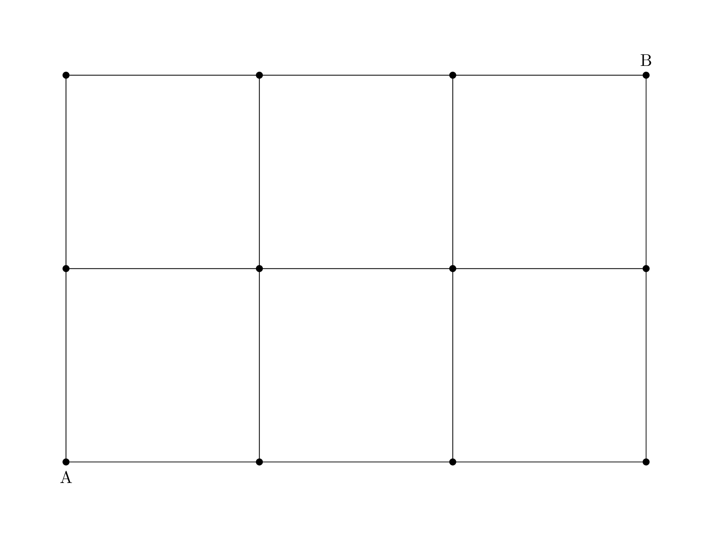
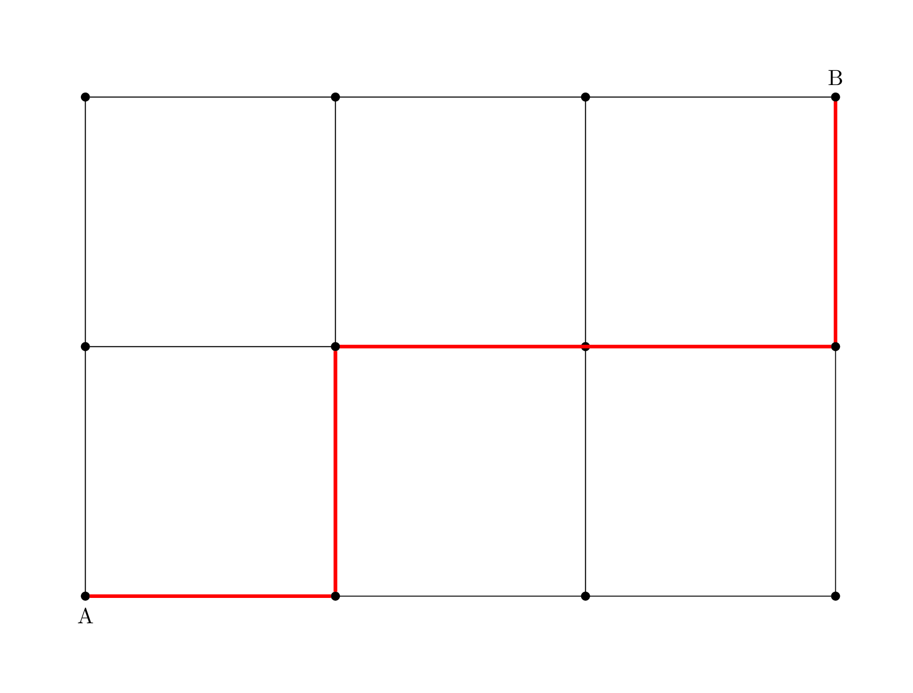
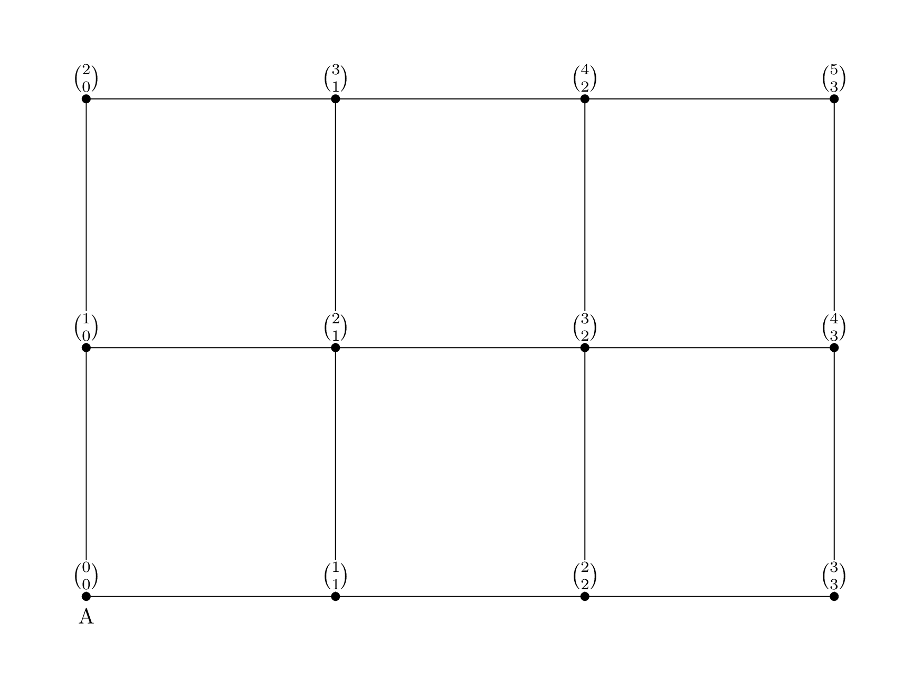
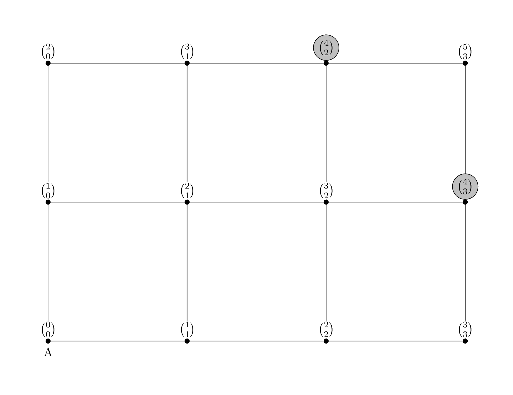
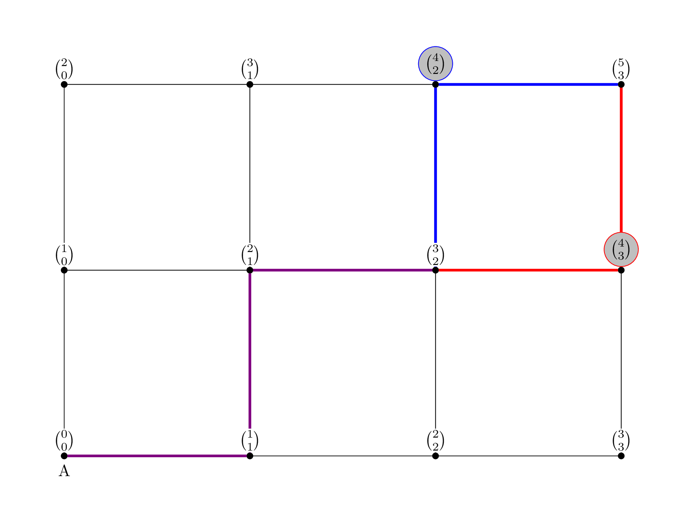

## Block-Walking Proofs
[Chapter 1.2](https://discrete.openmathbooks.org/dmoi3/sec_counting-binom.html)

> Remember: Please read the text linked above before reading the material below.

Block-walking proofs are categorized as a combinatorial proof, but the method is quite different. Instead of choosing two different ways to solve a problem, you prove that the problem is similar to a walk through Pascal's triangle, two different ways, ending at the same spot.

First: What does a walk through Pascal's triangle look like? Typically, you start at the top of the triangle, and either take a left or right step going downwards until you reach the desired spot.

While this type of proof is related to Pascal's triangle, the reason it's called a block-walking proof is that the story to use is one of a person or vehicle navigating a grid.

You'll notice in the text they call this a lattice path. This is another name, but we'll stick with block-walking and grid as this is the context of block-walking proofs.

Imagine you want to count the number of paths you could take from point A to point B, but you don't want to backtrack or loop as we want the set of _shortest paths_. In other words, how many ways can you get from A to B only going upward or to the right along the lines of the grid, taking the shortest distance possible. Since we're in the mindset of a map, we'll think of this as choosing to go North or East.

> Think first: Draw multiple paths yourself. What do you notice about the length of these paths?
> Can you think of a way to describe your path to another person verbally (without drawing it)?

When taking a path, we know we can only go North or East. So to give directions, we can give an ordered list of North or East steps.

The above image shows East, North, East, East, North.

Since B is 2 North moves and 3 East moves from A, we know we need at least 5 steps. This must be our shortest path. But how many of these paths exist?

> Think first: Try to think of an answer to this problem before continuing!
> Hint: When we wrote our ordered list, we said North and East, but if we wanted to save time, we could just use N and E.

This is a letter rearrangement problem! We need to go 2 North and 3 East, but the order in which we do these is how the paths differ. By counting the number of ways to arrange 2 Ns and 3 Es, we can find the answer to our problem.

There are two ways to think of rearranging letters when there are only two distinct letters to rearrange:

- The "normal" way.

There are 5 total letters, then 2 repeats and 3 repeats, so we have $\frac{5!}{2!3!}$ as our solution.

- The combinations way.

We have 5 steps we need to write. We can first select where the Ns will go in ${5 \choose 2}$ ways. Then the remaining spots will be filled with Es. This thinking can also be applied in the other direction: We select where the Es will go in ${5 \choose 3}$ ways, and the Ns will fill in the remaining spaces.

All ways result in the same answer, but I encourage you to think in the combinations way for the next part.

> Check your understanding: Fill in the number of ways to get to each intersection of the grid from point A, taking the fewest amount of steps possible. You may compute the numbers, but it may be easier to leave these in combination form.
> What do you notice here?

Check your answer

This looks like Pascal's Triangle!

Indeed, this method of counting paths is closely related to Pascal's triangle, and we can use it to prove identities and properties related to the structure of Pascal's triangle.

Consider Pascal's Identity itself.

> Think first: How does this block-walking problem show that adding the two previous entries should result in the next entry?

Looking at our example from before, let's find the two previous entries in our grid.

We should notice that all paths to B must pass through one of these two points. These points differ in whether the last step is North or East.

Since the last step is different for all paths that pass through these points, the set of paths through point C and the set of paths through point D are disjoint.

By the Principle of Addition, we can add these.

> Check your understanding: How do we know this includes all potential paths from A to B?

Check your answer

As mentioned, these are the points one step away from the finish line.

You can check yourself by drawing paths that they must pass through one of these, since the last step must always be a North or an East by our rules.

While we were looking at a specific example, all of our reasoning holds in a general case, and so we have proven Pascal's identity again!

> Think about it: How does this proof relate to the combinatorial proof that we already did?
> Which do you _personally_ find easier for this problem? Which do you think is easier in general?
> Note that these last two questions are about you and your intuition, so there is no "right answer."

> Check your understanding: Can you prove that ${n \choose k} = {n \choose n-k}$ using block-walking?
> Hint: Where are each of these in the grid, and what is the relationship between the two problems? This is the key to your proof.
> You may need to try a specific example first, like ${5 \choose 2}$ and ${5 \choose 3}$

Check your answer

You may notice that ${n \choose k}$ is just a rotated version of ${n \choose n-k}$.

Therefore, these problems are the same, since we can rotate our paths over the line $y = x$

Another way to put this would be that we're simply swapping the N and E values to get a solution to the other problem.

You may notice that combinatorial proofs seem more relaxed than other proof types. Don't be fooled! These still need to be rigorous, and their relaxed nature can make it harder to spot mistakes.

> Arriving at the correct conclusion does not mean that your proof is valid.

Keep in mind that the lessons we learned in week 4 still apply.

_Note:_ All the grids on this page were made using the Tikz package in LaTeX. It's very useful, but can be challenging to use.